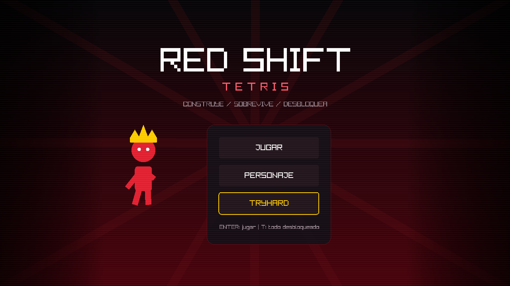

# Red Shift Tetris



Tetris original desarrollado con **C++14 y Raylib**, organizado con clases
pequeñas y archivos `.h/.cpp`. La arquitectura toma como referencia educativa
el estilo class-based de [Cpp-Tetris-Game-with-raylib](https://github.com/educ8s/Cpp-Tetris-Game-with-raylib),
pero el código, la interfaz, la campaña, el personaje, los mapas y los shaders
de este proyecto fueron implementados desde cero.

## Características

- Pantalla de inicio con paleta roja y negra.
- Siete tetrominos mediante una clase base `Block` y siete clases derivadas.
- Tablero 20 × 10 encapsulado en `Grid`.
- Diez niveles con nombre, mapa procedural, shader, velocidad y meta propios.
- Dificultad Fácil, Normal o Difícil seleccionable para cada nivel.
- Personaje personalizable con cinco colores.
- Diez accesorios que se desbloquean al superar los diez niveles.
- Modo administrativo `TryHard` para revisar temporalmente todo el contenido desbloqueado.
- Personaje animado haciendo una pose distinta junto a cada tarjeta de nivel.
- Mejores puntuaciones y progreso guardados automáticamente.

## Arquitectura orientada a objetos

| Clase | Responsabilidad |
|---|---|
| `Game` | Coordina pantallas, entrada, reglas, shaders y progreso. |
| `Grid` | Mantiene la matriz C `int[20][10]`, dibuja y limpia filas. |
| `Block` | Clase base con posiciones, movimiento, rotación y dibujo. |
| `IBlock`…`ZBlock` | Clases derivadas que definen las rotaciones de cada pieza. |
| `Position` | Modelo pequeño para representar fila y columna. |
| `Character` | Conserva apariencia y dibuja poses y accesorios. |
| `Level` | Contiene reglas y genera el mapa procedural de una fase. |
| `SaveData` | Carga, valida y guarda progreso y puntuaciones. |

La API C de Raylib (`DrawText`, `Color`, `Shader`, `RenderTexture2D`) se combina
con clases, encapsulación, herencia y contenedores de C++ (`vector`, `map`,
`array`, `string`). `main.cpp` sólo configura Raylib y llama `Game::Update()` y
`Game::Draw()`.

## Compilación en Windows

Requiere Raylib en `C:/raylib/raylib` y w64devkit en
`C:/raylib/w64devkit`.

```powershell
C:\raylib\w64devkit\bin\mingw32-make.exe
```

Los archivos intermedios se generan en `build/release/` y el ejecutable final
queda disponible como `main.exe` y `bin/red_shift_tetris.exe`.

Para compilar una versión de depuración, con símbolos y sin optimizaciones:

```powershell
C:\raylib\w64devkit\bin\mingw32-make.exe BUILD_MODE=DEBUG
```

Para eliminar los archivos generados sin borrar la carpeta `build/`:

```powershell
C:\raylib\w64devkit\bin\mingw32-make.exe clean
```

```powershell
.\main.exe
```

## Controles

| Contexto | Acción | Control |
|---|---|---|
| Menús | Confirmar | `Enter` |
| Inicio | Abrir TryHard | `T` o botón `TRYHARD` |
| Selector | Navegar | Flechas |
| Selector | Abrir personaje | `C` |
| Selector | Fácil / Normal / Difícil | `1` / `2` / `3` o ratón |
| Personaje | Elegir color o accesorio | Ratón |
| Partida | Mover | `A`/`D` o izquierda/derecha |
| Partida | Caída suave | `S` o abajo |
| Partida | Caída instantánea | `Espacio` |
| Partida | Rotar | `X` o arriba |
| Partida | Pausa | `Esc` |
| Pausa | Abandonar nivel | `Q` |

## Cómo funciona

1. `Game` crea una bolsa con una instancia de cada tetromino.
2. La pieza actual recibe comandos y consulta `Grid` antes de conservar el movimiento.
3. Cuando ya no puede bajar, sus celdas se copian a la matriz de `Grid`.
4. `Grid::ClearFullRows()` elimina filas y baja las superiores.
5. Alcanzar la meta de líneas completa el nivel y desbloquea su recompensa.
6. `SaveData` conserva el siguiente nivel, accesorios, aspecto y récords.
7. La escena se dibuja en `RenderTexture2D` y después pasa por el shader del nivel.

`TryHard` permite probar los diez niveles y los once accesorios sin alterar el
progreso, los récords ni la apariencia guardada de la partida normal.

## Estructura

```text
include/
├── game.h
├── grid.h
├── block.h / blocks.h
├── character.h
├── position.h
├── save_data.h
└── colors.h
src/
├── main.cpp
├── core/
│   └── game.cpp
├── physics/
│   ├── grid.cpp
│   ├── block.cpp / blocks.cpp
│   └── position.cpp
├── graphics/
│   ├── character.cpp
│   └── colors.cpp
└── data/
    └── save_data.cpp
levels/
└── level.h / level.cpp
build/
├── release/              # Objetos .o y dependencias .d de Release
└── debug/                # Objetos .o y dependencias .d de Debug
bin/
└── red_shift_tetris.exe  # Ejecutable final
shaders/
└── level_01.fs ... level_10.fs
```

Todas las funciones tienen un comentario inmediatamente anterior que explica su
responsabilidad. Las formas visuales son procedurales, por lo que el juego no
depende de imágenes externas.
